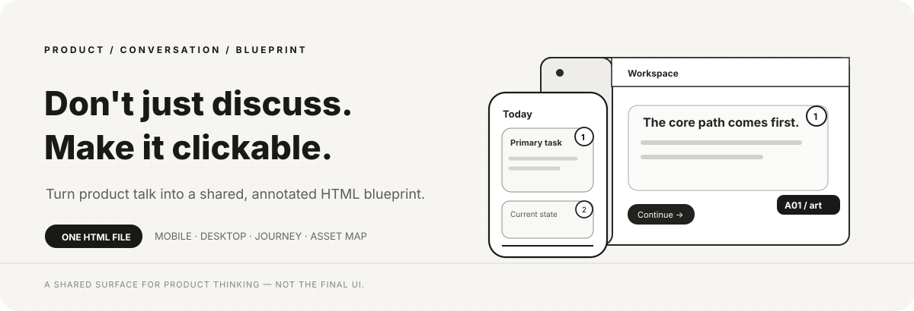
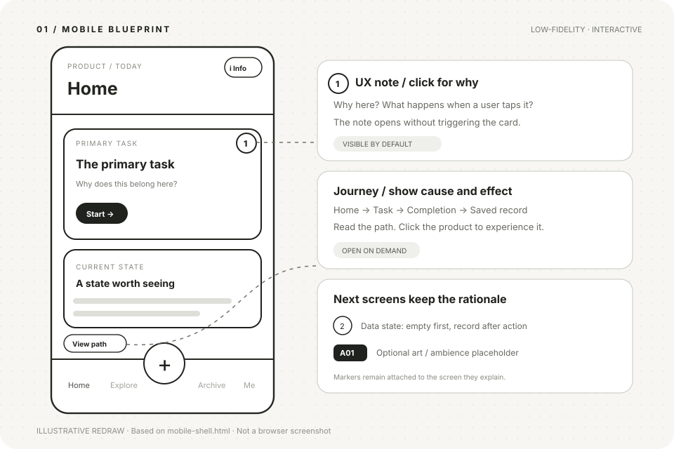
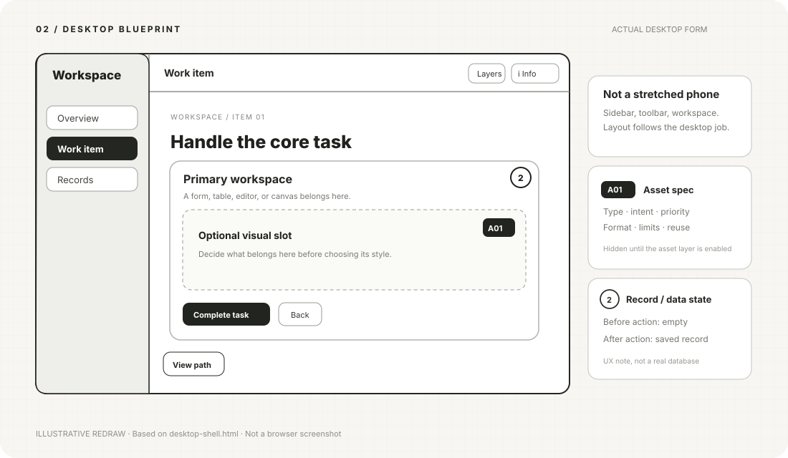

# Product Wireframe Prototyper

> 把聊不清的产品，变成点得动的共同语言。



产品讨论最难的，往往不是没有想法，而是**每个人脑海里都有一张不一样的界面**。

你说「首页放一个入口」，AI 想的是一张卡片；同伴想的是底部按钮；业务方以为点进去会直接得到结果。文字看似达成共识，直到真正开始做，才发现大家同意的不是同一件事。

Product Wireframe Prototyper 把这段对话变成一份能打开的 HTML 线稿：可以沿着产品按钮走完一条真实路径，可以点开标注看设计理由，也可以提前指出哪里依赖图片、声音或字体。**它不是为了把界面画漂亮，而是为了让分歧尽早变得可见。**

[看移动端骨架](assets/mobile-shell.html) · [看桌面端骨架](assets/desktop-shell.html) · [读 Skill 规则](SKILL.md)

## 安装

```bash
npx skills add Haaaiawd/product-wireframe-prototyper
```

按照安装器提示选择要安装到的 AI Agent。若希望在所有项目里使用，可以加 `-g`；先查看仓库识别到了什么 Skill，则加 `--list`。

## 看得见，也点得动

### 移动产品：界面本身就是讨论现场



首页的卡片能进入下一步，`＋` 可以展开产品内部的选项；`①` 贴在需要解释的地方，点它只弹说明，不会顺手把你带到另一页。右下角之外没有一排「原型切页按钮」替产品导航做决定。

### 桌面产品：真的按桌面任务组织



桌面工作台有自己的侧栏、工具区和主工作区，不是把手机卡片拉宽。查看它的线稿时，页面说明藏在 `ⓘ 说明` 后；在窄屏预览里，说明可作为抽屉打开，而不是让关键信息直接消失。

> 上面两张是根据随 Skill 提供的骨架绘制的**结构示意图**，不是浏览器运行截图。打开 HTML 骨架，才能实际点击与检查状态。

## 一个线稿，四种看法

| 你想弄清的问题 | 在线稿里怎么看 |
| --- | --- |
| **用户能做什么？** | 直接点产品自己的导航、卡片、按钮、浮层，观察页面与状态变化。 |
| **为什么这样做？** | 点默认可见的 `① ② ③`；标注贴着具体位置，解释用途、取舍、假设或尚未定下的问题。 |
| **用户究竟怎么走？** | 点「查看路径」，阅读谁从哪里开始、做了什么、结果是什么；路径是讲解，不是第二套导航。 |
| **这里还缺什么？** | 按需开启 Asset Map：在目标位置标出资产类型、优先级、约束与复用，不提前把线稿涂成成品。 |

数据也是设计的一部分，但不必再造一套满屏的编号。**数据来源、空状态、加载／失败、何时出现结果**，放进对应区域的 UX 标注里。例如归档页的 `②` 可以说明：「尚未完成时为空；完成保存动作后才出现记录。」示例骨架用本地状态演示这个关系，不声称接入了真实数据库。

资产标记则保留独立、默认隐藏的语言：

| 标记 | 表示什么 | 典型问题 |
| --- | --- | --- |
| `A01` | 背景、插画、纹理、动画等视觉资产 | 这张图是 MVP 必需吗？适配什么画幅？能否裁切复用？ |
| `♫01` | 环境音、音效等声音资产 | 需要循环吗？静音时体验还能成立吗？ |
| `T01` | 字体、字形或主题类资产 | 中文字符是否完整？授权和可读性如何？ |

普通边框、按钮、图表和布局不因为「将来要做」就自动成为美术资产。线稿的作用是指出依赖，不是制造一份令人窒息的素材采购单。

## 让每一轮交流有落点

它适合发生在 PRD 已经有雏形、但还不该急着写正式前端的那段时间：产品经理与设计师讨论入口，创始人与业务方确认核心路径，或者一个人和 AI 反复推敲自己的产品想法。

```text
想法 / 一段产品对话
       ↓
最短的用户任务与页面状态
       ↓
一份可点击、可标注的 HTML 线稿
       ↓
点出分歧 → 修改同一份线稿 → 再讨论
```

上一轮的 HTML 可以在下一轮继续交给 AI 修改。于是「这里为什么有按钮」「完成后到底保存了什么」「静思页到底需不需要背景」不再是漂浮在聊天里的句子，而是有页面、有位置、有状态的讨论对象。

### 试着这样提需求

移动端：

> 我想做一个晚间日记应用。先不要做视觉稿，请用 Product Wireframe Prototyper 画一个能点的移动端 HTML 线稿：从首页进入静思，再开始写作，最后能看到保存后的记录。把需要我决定的地方做成 UX 标注；静思背景和环境音如果影响体验，再加 Asset Map。

桌面端：

> 我在设计一个 B 端售后工作台。请用 Product Wireframe Prototyper 做桌面端线稿，重点展示「收到工单 → 核验证据 → 选择处理方案 → 确认结果」这条路径。不要用手机布局放大。标注每一步的判断依据，以及空数据、处理中和已完成分别应该显示什么。

如果第一版和你心里的产品不同，直接说「保留这份 HTML，把入口改到这里、删掉那个状态」。原型是协商的底稿，不是需要一次猜中的标准答案。

## 交付与边界

- **交付**：一份自包含的 `.html`，内置样式与交互；可本地打开，无账号、构建或后端依赖。目标产品可以是移动端、桌面端，或明确设计过断点的响应式产品。
- **默认体验**：产品能点击，UX 标注可见；路径和页面说明按需打开；Asset Map 只有在资产确实重要时加入，并默认隐藏。
- **生成方式**：可以先确定最短路径，再逐步补页面、标注与资产；「最终单文件」不意味着 AI 必须一次生成完整系统。
- **不承诺**：它不是可上线的前端、不会自动保存每轮聊天决策，也不替代真实用户测试、正式视觉设计或后端数据。聊天工具能否内嵌预览 HTML 取决于所在平台；文件本身仍可下载打开。

## 目录

```text
SKILL.md                    给 AI 的生成与验证规则
README.md                   你正在读的项目介绍
assets/mobile-shell.html    移动产品的交互骨架
assets/desktop-shell.html   桌面产品的交互骨架
docs/*.svg                  README 使用的示意插图
```

---

<div align="center">

**先让东西有位置，再讨论它该长什么样。**

一份能点的线稿，往往比十轮「你理解我的意思吗」更诚实。

</div>
